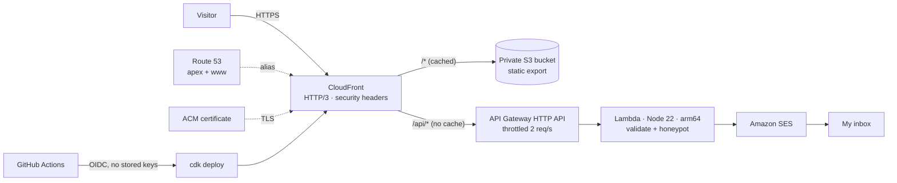

# Portfolio on AWS

The same site that runs on Vercel, hosted on AWS and defined entirely in code with AWS CDK
(TypeScript). It's a small, complete example of how I like to build: private by default, least-privilege
IAM, no long-lived credentials, tested infrastructure, and close to zero running cost.

## Architecture



| Decision | Why |
|---|---|
| S3 bucket fully private, read only by CloudFront (Origin Access Control) | Nothing is publicly reachable except through the CDN and its security headers. |
| Contact API served from the site's own domain (`/api/*` behavior) | Same origin, so no CORS configuration and no second domain to secure. |
| CloudFront Function for routing | Maps `/work` → `/work/index.html` for the Next.js static export and redirects `www` → apex at the edge, for a fraction of a cent per million requests. |
| Lambda on arm64 with input validation, honeypot and API throttling | Cheaper than x86. Spam and abuse are stopped before they cost anything. |
| SES permission scoped to specific identities | The function can send mail only as the configured addresses. |
| GitHub OIDC role that can only assume the CDK bootstrap roles, and only from `main` | Deploys use short-lived credentials, so there is no stored secret to leak. |
| Infrastructure tests (`npm test`) | Security properties (private bucket, HTTPS only, IAM scope) are asserted in CI, not just hoped for. |

**Expected cost** at personal-site traffic: a Route 53 hosted zone is $0.50/month. CloudFront, S3,
Lambda, API Gateway and SES usage for a portfolio typically stays within the AWS free tier or a few cents.

## Layout

```
infra/
├── bin/app.ts                  # CDK app: stacks + config from cdk.json context
├── lib/site-stack.ts           # S3, CloudFront, ACM, Route 53, contact API
├── lib/github-oidc-stack.ts    # One-time: GitHub Actions deploy role
├── lambda/contact.ts           # Contact form handler (SES)
└── test/                       # Stack assertions + handler unit tests
```

## Deploy it yourself

Prerequisites: an AWS account, the AWS CLI configured (`aws configure` or SSO), Node 22.

```bash
# 1. Build the static site (from the repo root)
STATIC_EXPORT=1 npm run build              # writes out/
# ...or with the contact API enabled:
STATIC_EXPORT=1 NEXT_PUBLIC_CONTACT_ENDPOINT=/api/contact npm run build

# 2. One-time CDK bootstrap for us-east-1
cd infra && npm ci
npx cdk bootstrap aws://<ACCOUNT_ID>/us-east-1

# 3. Deploy (all -c flags are optional)
npx cdk deploy PortfolioSite \
  -c domainName=example.com \
  -c contactEmail=you@example.com
```

The `SiteUrl` output is the live address. Without `domainName` it's the `*.cloudfront.net` URL.

### Optional settings

| Context key | What it does |
|---|---|
| `domainName` | Serves the site on this domain and `www.` with a free ACM certificate. Needs a Route 53 hosted zone for the domain. To keep the main domain on Vercel, use a subdomain such as `aws.example.com`. |
| `hostedZoneName` | Hosted zone name if it differs from `domainName` (e.g. `example.com` for `aws.example.com`). |
| `contactEmail` | Enables `/api/contact` and delivers messages here. Verify the address in SES first (SES console → Identities). New SES accounts are in the sandbox, which is fine because this only ever sends to your own verified address. |
| `contactFromEmail` | Sender address. Defaults to `contactEmail`. Use an address on your own domain for best deliverability: mail "from" a Gmail address sent via SES fails DMARC checks and may land in spam. |

### Automatic deploys from GitHub

1. Create the deploy role once (use your own credentials):
   ```bash
   npx cdk deploy PortfolioGithubDeploy
   # If the account already has a GitHub OIDC provider:
   #   -c githubOidcProviderArn=arn:aws:iam::<ACCOUNT_ID>:oidc-provider/token.actions.githubusercontent.com
   ```
2. In GitHub → Settings → Secrets and variables → Actions → **Variables**, add:
   - `AWS_DEPLOY_ROLE_ARN`: the `DeployRoleArn` output
   - optional: `DOMAIN_NAME`, `HOSTED_ZONE_NAME`, `CONTACT_EMAIL`, `CONTACT_FROM_EMAIL`
3. Every push to `main` now runs `.github/workflows/deploy-aws.yml`. Until `AWS_DEPLOY_ROLE_ARN`
   is set, that workflow is skipped.

## Develop

```bash
npm run typecheck
npm test                                   # 23 tests: stacks + contact handler
npx cdk synth PortfolioSite                # inspect the CloudFormation
npx cdk diff PortfolioSite                 # compare with what's deployed
```

## Tear down

```bash
npx cdk destroy PortfolioSite              # removes the bucket, its files and the CDN
```
